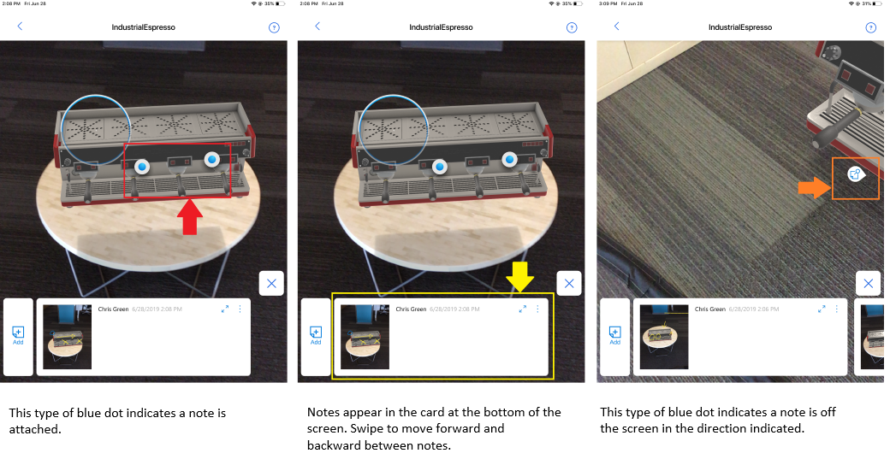
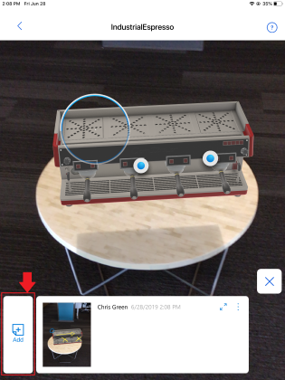
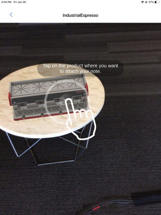
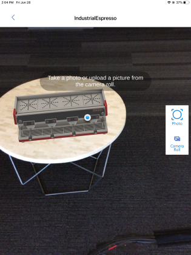
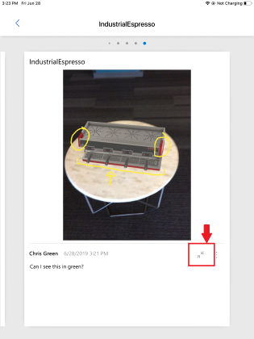
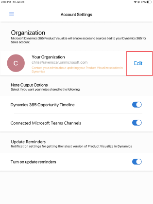

# Add a note to your 3D model in Dynamics 365 Product Visualize

[!INCLUDE [cc-beta-prerelease-disclaimer](../includes/cc-beta-prerelease-disclaimer.md)]

You can capture notes on specific points on a 3D model in Microsoft Dynamics 365 Product Visualize, and even add text or ink to the notes. For example, when you’re in the field with a customer, capture any required product changes directly on the model. 

To add a note, you tap the location of the model where you want to add the note, and then take a picture of the model or upload a picture from your photo library to set the context. Then you can draw (ink) on the image or add comments. Notes you create are saved in a folder in the root product folder (not the folder for a particular product). The notes are organized by Opportunity ID, Product ID, and model name.

To review notes you have made on your model, you can tap any spatial anchor on the model. Anchors on the front of the model appear as blue circles with white outlines. Anchors on the back appear as blurred circles with transparent outlines. You can also browse through your notes by swiping the notes cards at the bottom of the screen. The corresponding spatial anchor activates on the model as you swipe. 

## Add a note

1.	After placing a model, select **Notes** on the right side of the screen.

    
 
2.	Select **Add Note**.

    
 
3.	Tap the model where you want to place the note. 

    
 
4.	Do one of the following:

    -	To take a picture, select **Capture** on the right side of the screen. The app takes a picture of the model.
    
    -	To use a picture from your camera roll, select **Camera Roll**, and then select the picture you want.
    
        
   
5.	In the **Create Note** screen:

    - To ink on the screen, select a color and start drawing. For example, draw an arrow to call out a particular part of the model.
    
    - To add text, tap the box at the bottom of the screen, and then enter the text you want.
    
       
 
       > [!NOTE]
       > If you’re not happy with the picture, select **Replace** to redo the capture or select a different picture from your camera roll. When you select **Replace**, any text you entered is retained, but inking is lost.    

## View the notes attached to a model

1.	After placing the model, select **Notes** on the right side of the screen.

     

2.	Tap a blue dot to open a specific note, or swipe right or left in the notes browser at the bottom of the screen to go forward or backward between notes.

    > [!NOTE]
    > If you want to see a larger view of the notes, which is useful if you can’t see all the text in the notes card, tap the expand arrow in the upper-right corner of the notes card or flick up. Then you can use the scroll bar in the notes card to scroll the text. 
    
     
     
## Edit or delete a note

1.	Select **Notes** on the right side of the screen.

2.	Select the **Overflow** menu  in the upper-right corner of the notes card.

3.	In the **Options** dialog box, select **Edit note** or **Delete note**.

     
  
## Change how your notes are shared with other apps

By default, your notes are saved to the SharePoint account associated with your Dynamics 365 for Sales account. By default, Product Visualize also sends your notes to your Dynamics 365 for Sales timeline and any connected Microsoft Teams channel. 

To turn off sharing with the Dynamics 365 for Sales timeline or Microsoft Teams channels:

1. Select the Main menu button , and then select **Edit** next to the organization you're signed in to.

   

2. Under **Note Output Options**, move the sliders to the off position for the options you want to turn off.
 
## Export a note

You can export your notes to share them with other apps on your device that support the iOS sharing function. The notes image and text are exported without any special formatting.

To export a note:

1.	Select **Notes** on the right side of the screen.

2.	Select the **Overflow** menu  in the upper-right corner of the notes card.

3.	In the **Options** dialog box, select **Export note**.   

### See also

[Install, open, and sign in to the app](sign-in.md) 
[Place and manipulate 3D models](manipulate-models.md) 
[View layers of your 3D model](layers.md) 
[Explore sample 3D models](explore-samples.md)
